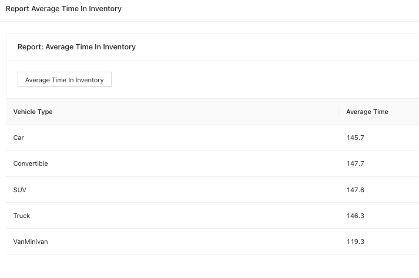

# Jaunty Jalopies Car Dealership System

## Description

Roland Around is the owner of an auto dealership, Jaunty Jalopies. While he’d like to eventually have a full website like most dealerships, he’s decided for now that he’d just like a simple application so that he can update his inventory, track sales, maintain repair history, and let customers search inventory. Right now, he doesn’t have enough staff to take pictures of vehicles, so only the details will be stored in the database. Along with the functions to support his operations, he also wants some reports so he can track how well his business is doing.

## Key Words

- Frontend: React.js
- Backend: Spring Boot
- Database: MySQL

## My Responsibilities

This is a full stack team project I worked on in November 2021. I have contributed on work ranged from the frontend, backend, to database.

## Step 1: Start MySQL Database Server

The following instructions are for Mac users:

#### 1.0 Download MySQL and MySQL Workbench

- https://dev.mysql.com/downloads/mysql/
- https://dev.mysql.com/downloads/workbench/

#### 1.1 Open System Preferences

Click MySQL icon:


#### 1.2 Start MySQL Server


#### 1.3 Open MySQL Workbench

Enter database credentials and click Test Connection:


Once successfully connected to the MySQL database server, you should get the following message:

[](db4.png)

#### 1.4 Populate Data

Install MySQL connector module

```
pip3 install mysql-connector-python
```

I wrote a Python script to populate the sample data in the database. Go to the project directory and run the following command:

```
python3 sqlDemo/populate_data.py
```

[](db5.png)

Enhanced Entity-Relationship (EER) Diagram

[](datamodel.png)

## Step 2: Start Backend Server

#### 2.0 Download Intellij IDEA

- https://www.jetbrains.com/help/idea/installation-guide.html#toolbox

#### 2.1 Open Project Folder

Run application via main():

[](be1.png)

## Step 3: Start Frontend Server

In the jaunty_jalopies_frontend directory, run:

```
npm start
```

Go to http://localhost:3000/

## Demo & Role Functionalities

0. Anonymous Users: Search
1. Owner: Vehicle Search, Report, Add Vehicle, Repair
2. Salesperson: Vehicle Search, Sell Vehicle
3. Inventory Clerk: Vehicle Search, Add Vehicle
4. Service Writer: Vehicle Search, Repair, Part Request
5. Manager: Vehicle Search, Report

### Anonymous Users

[](anon1.png)

Filter by keyword "SUV"

[](anon2.png)

### Login As Owner

[](owner1.png)

```
username = "roland"
password = "roland"
```

[](owner2.png)

Owner has full access of the system

### Login As Salesperson

```
username = "user01"
password = "pass01"
```

Owner and Salespersons can make new sale order of vehicles.

[](sale1.png)

[](sale2.png)

[](sale3.png)

### Login As InventoryClerk

```
username = "user03"
password = "pass03"
```

Owner and Inventory Clerks can make purchase orders to replenish vehicle inventory.

[](addV.png)

### Login As ServiceWriter

```
username = "user12"
password = "pass12"
```

Owner and ServiceWriters can create new repair orders on vehicles.

[](repair1.png)

[](repair2.png)

[](repair3.png)

### Login As Manager

Owner and Managers can access reports with statistics extracted using SQL.

```
username = "user02"
password = "pass02"
```

[](report1.png)

[](report2.png)

[](report3.png)

[](report4.png)

[](report5.png)
